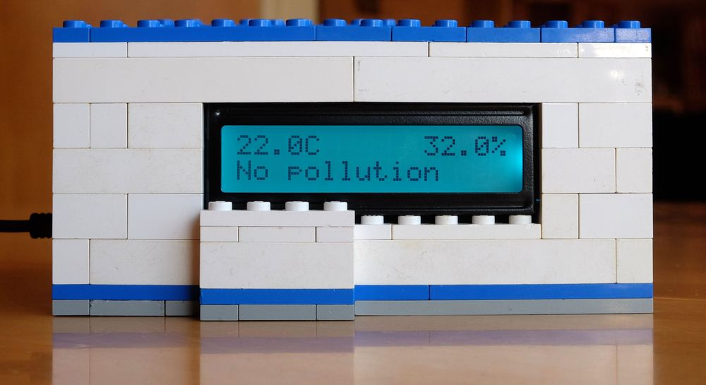

# Air quality measurement system
Built with:
* [Raspberry Pi 1 Model B](https://www.raspberrypi.org/products/model-b/)
* USB power adapter for the Pi
* [GrovePi+ board](https://www.dexterindustries.com/shop/grovepi-board/) (firmware version 1.2.7)
* [Grove RGB LCD display](http://wiki.seeed.cc/Grove-LCD_RGB_Backlight/)
* [Grove temperature and humidity (DHT) sensor ](http://wiki.seeedstudio.com/wiki/Grove_-_Temperature_and_Humidity_Sensor)
* [Grove air quality sensor](http://www.seeedstudio.com/wiki/Grove_-_Air_Quality_Sensor_v1.3)
* Lego bricks for the case

## Example case

